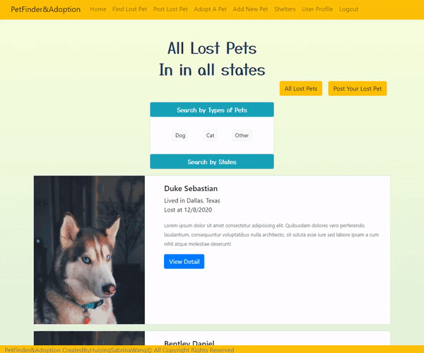
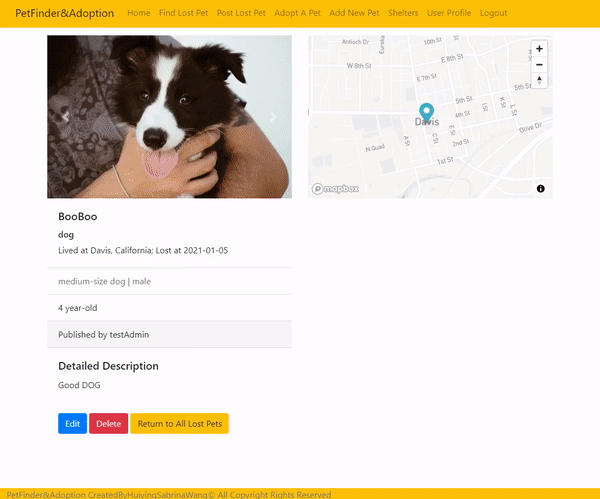
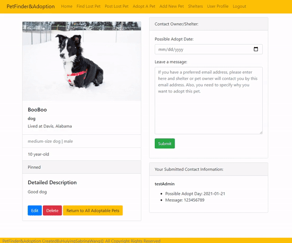
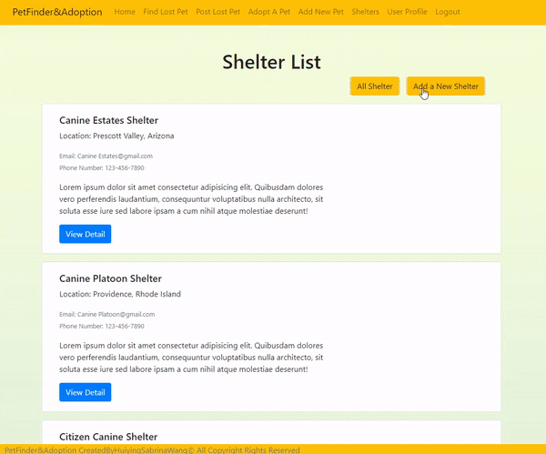
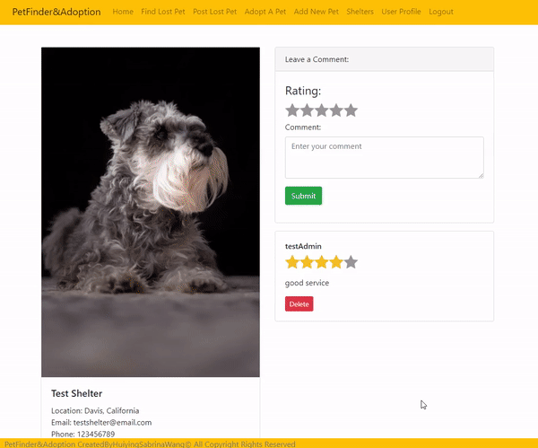
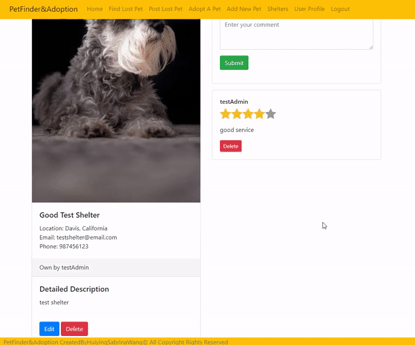
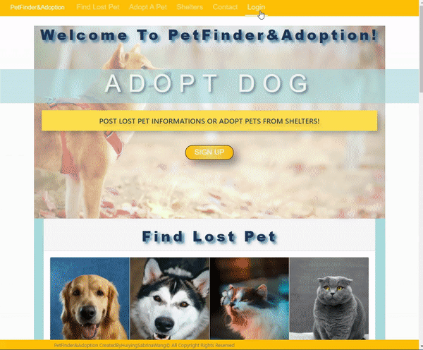
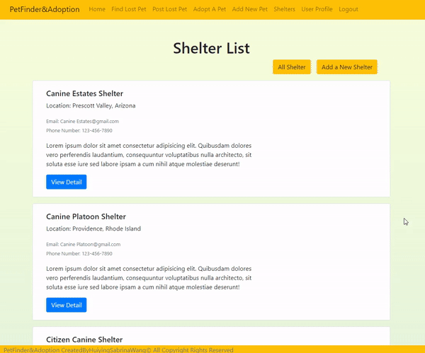

# [PetFinderWebsite](https://mysterious-plateau-38458.herokuapp.com/)
### Click above title to the website application, which is deployed in Heroku.
# Website Feature Walkthrough
# 1. Home Page
### Home page contains some information about lost pets, adoptable pets and shelters. It also includes links to other sub-pages.
 
# 2. Find Lost Pets Page
### '/petfinder' shows all lost pets.  Once sign in, users can create, edit, and delete their own lost pet post.   Users can search the lost pets list according to types of pets or states.
 
## (a) Make a New Post
 
## (b) Edit Exist Post
 
# 3. Adopt Pets Page
### '/petAdoption' shows all adoptable pets that posted by either shelters or individual users.   Once sign in, individual users can create, edit and delete their own posts.   Users can search the adoptable pets list according to types of pets or states.  Users can leave a message and possible adopt date for the pet thay want to adopt. Then that pet owner or shelter owner can send emails to verify information and continue adoption process.
 
## (a) Make a New Post
 
## (b) Edit Exist Post
 
# 4. Shelter Page
### '/shelter' shows all shelters.   Users can only create one shelter and be the owner of that shelter.   Users can also edit and delete the shelter they created.   In addition, shelter owners can add adoptable pets to their shelter and modify or delete these adoptable pet posts.  Users who adopt pets from that shelter can leave a comment on the shelter page. 
## (a) Make a New Shelter
 
## (b) Edit Exist Shelter
 
## (c) Adds New Adoptable Pet to Shelter
 
# 5. Users
## (a) User Register
 
## (b) User Profile
### User Profile page allows users to modify their lost pets, adoptable pets and shelter.   They can also check the contact list that contains information of people who want to adopt pets.
 
